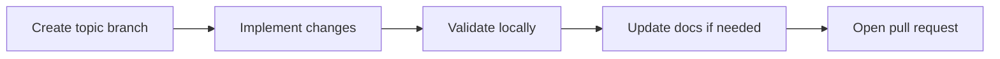

# Contributing to AimBuddy

Thanks for contributing. This project includes performance-sensitive Android and C++ runtime paths, so review quality is more important than change volume.

## Contribution Principles

- Fix root causes, not symptoms.
- Keep pull requests focused on one objective.
- Preserve behavior unless the change scope explicitly includes behavior updates.
- Prefer simple and maintainable implementations.

## Development Workflow



1. Create a topic branch from `main`.
2. Implement with minimal unrelated edits.
3. Validate locally (build + on-device test).
4. Update docs when behavior, architecture, settings, or workflow changed.
5. Open a pull request with clear evidence of validation.

## Required Validation

### Android Build

Run before opening a pull request:

```powershell
./gradlew.bat clean assembleDebug
```

### Runtime Validation

If your change affects detection, tracking, or aim control:

1. Install the debug APK on a test device.
2. Verify basic detection works (enemies detected and boxes drawn).
3. Verify aim assist tracks and releases correctly (if root available).
4. Check logcat for errors or warnings.

### Training Pipeline

If your change touches training or export:

1. Run the affected scripts in `training/scripts/`.
2. Include output summary and report paths in your PR.

## Code Standards

- No placeholder implementations, dead code, or commented-out blocks.
- Keep naming consistent with existing module conventions.
- Keep hot paths efficient: no allocations, no locks, no logging in per-frame loops.
- Avoid unrelated formatting-only churn.
- Do not mix broad refactors with behavior changes in the same pull request.

### Hot Path Rules

These paths run every frame. Extra care is required:

| Path | File | Rules |
|------|------|-------|
| Inference loop | `esp_jni.cpp` | No allocs, no locks, pre-allocated buffers only |
| Target tracker | `target_tracker.cpp` | Fixed-size arrays, no heap, no logging |
| Aim controller | `aimbot_controller.cpp` | Snapshot settings, no blocking, bounded math |
| Overlay render | `imgui_menu.cpp` | No setting writes during draw, defer saves |

### Settings Safety

- All settings changes go through `UnifiedSettings::validate()` before hot-path use.
- New settings must have safe defaults and clamp ranges.
- Preset values must be updated when adding or changing defaults.

## Pull Request Content

Include in your PR description:

1. **Problem statement**: What issue or feature this addresses.
2. **Technical approach**: How you solved it and why.
3. **Validation output**: Build log, device test results, logcat output.
4. **Risk and rollback notes**: For behavior changes, explain how to revert.
5. **Scope boundaries**: What this PR intentionally does not change.

## Review Criteria

A pull request can be rejected if it:

- Bundles unrelated changes.
- Lacks local validation evidence.
- Introduces architecture drift without clear justification.
- Reduces maintainability or runtime stability.
- Adds per-frame cost without measured benefit.

## Documentation Standards

- Keep docs clear, direct, and easy to follow.
- Use tables for structured data, mermaid diagrams for flows.
- No em dashes. Use commas, periods, or parentheses instead.
- Keep Android and training commands aligned with current repository behavior.
- Use "aim assistant" terminology in user-facing documentation.
- Update these files when relevant: `README.md`, `docs/`, and `training/README.md`.

## File Reference

| What to Update | When |
|----------------|------|
| `README.md` | New features, build steps, dependencies |
| `docs/Architecture.md` | Module changes, threading, data flow |
| `docs/SettingsGuide.md` | New settings, preset changes, default changes |
| `docs/Performance.md` | Optimization changes, new telemetry |
| `docs/Training.md` | Pipeline steps, dataset format, export changes |
| `docs/Troubleshooting.md` | New known issues, diagnostic steps |

## Licensing

By contributing to this repository, you agree that your contribution is released under the repository license in `LICENSE`.
