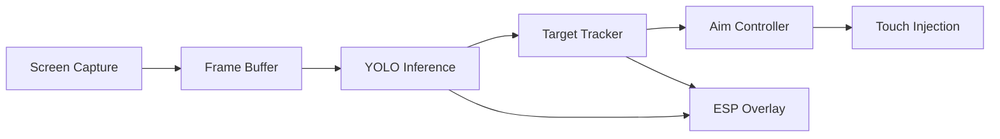

# AimBuddy

AimBuddy is an AI-based Android aim assistant for real-time screen capture, object detection, target tracking, visual guidance overlays, and optional assisted input.

## Project in Brief

- **Platform**: Android (arm64-v8a)
- **App stack**: Kotlin + Jetpack Compose + native C++ (JNI)
- **Inference**: NCNN runtime with Vulkan GPU acceleration (YOLOv26n)
- **Training**: Python pipeline with Ultralytics, PyTorch, and NCNN export

## Runtime Modes

| Mode | Root Required | Features |
|------|---------------|----------|
| Visual Assist | No | Screen capture, YOLO inference, target tracking, ESP overlays |
| Assisted Input | Yes | Everything above + low-latency touch injection via uinput |

If root is unavailable, the app remains fully functional in Visual Assist Mode.

## How It Works



1. **Capture**: MediaProjection captures the game screen at 1280x720.
2. **Detect**: YOLOv26n runs on the GPU via NCNN to detect enemies.
3. **Track**: DeepSORT-style tracker maintains target identity across frames.
4. **Aim**: PD controller steers aim with velocity lead and jitter suppression.
5. **Render**: ESP overlay draws boxes, snap lines, and an ImGui settings menu.

## Device Requirements

### Runtime (Android Device)

| Item | Minimum | Recommended |
|------|---------|-------------|
| Android | 11 (API 30) | 13+ |
| ABI | arm64-v8a | Snapdragon 888+ |
| Graphics | OpenGL ES 3.1 | OpenGL ES 3.2 + Vulkan |
| RAM | 6 GB | 8 GB+ |
| Storage | 2 GB free | 5 GB+ free |
| Root | Not required for ESP | Required for aim assist |

### Training (Windows PC)

| Item | Minimum | Recommended |
|------|---------|-------------|
| OS | Windows 10 64-bit | Windows 11 64-bit |
| Python | 3.10 to 3.12 | 3.11 |
| CPU | 4 cores | 8+ cores |
| RAM | 8 GB | 16 GB+ |
| Storage | 15 GB free | 30 GB+ free |
| GPU | CPU-only supported | NVIDIA with CUDA 12.1 |

## Quick Start

### 1. Build and Install

```powershell
./gradlew.bat clean assembleDebug
./gradlew.bat installDebug
```

Prerequisites:
- Android SDK 35
- Android NDK 29.0.13113456 rc1
- CMake 3.22.1
- Java 11+

### 2. First Launch

1. Open AimBuddy on your device.
2. Grant overlay permission when prompted.
3. Approve or deny root access (aim assist requires root).
4. Grant MediaProjection screen capture permission.
5. The overlay appears with ESP boxes and a floating settings icon.

### 3. Train Your Own Model (Optional)

```powershell
cd training
scripts\07_run_full_pipeline.bat
```

See the [Training Guide](docs/Training.md) for dataset setup and individual scripts.

## Build Details

### Debug Build

```powershell
./gradlew.bat clean assembleDebug
```

### Release Build

```powershell
./gradlew.bat clean assembleRelease
```

### Manual APK Install

```powershell
adb install -r app/build/outputs/apk/debug/app-debug.apk
```

## Training and Export

From the repository root:

```powershell
cd training
scripts\07_run_full_pipeline.bat
```

This runs environment setup, dataset validation, training, and NCNN export.

Key outputs:

| Output | Location |
|--------|----------|
| Reports | `training/outputs/reports/` |
| Weights | `training/outputs/runs/detect/train/weights/` |
| NCNN export | `training/outputs/export/` |
| Deployment target | `app/src/main/assets/models/` |

Individual scripts:

```powershell
scripts\01_setup_environment.bat
scripts\02_extract_frames.bat
scripts\03_validate_dataset.bat
scripts\04_train_adaptive.bat
scripts\05_train_manual.bat
scripts\06_export_ncnn.bat
```

## Documentation

| Document | Contents |
|----------|----------|
| [Architecture](docs/Architecture.md) | System design, threading, data flow, module reference |
| [Settings Guide](docs/SettingsGuide.md) | Every setting explained, presets, tuning workflow |
| [Performance](docs/Performance.md) | Pipeline targets, adaptive crop, telemetry, optimization |
| [Training](docs/Training.md) | Dataset format, training scripts, NCNN export |
| [Troubleshooting](docs/Troubleshooting.md) | Build, runtime, and training issue resolution |
| [Contributing](CONTRIBUTING.md) | Code standards, PR process, validation requirements |

## Repository Layout

```
app/                    Android app and native runtime
    src/main/
        java/           Kotlin sources (MainActivity, services)
        cpp/            C++ native code
            aimbot/     Target tracker, aim controller
            detector/   YOLO inference (NCNN)
            input/      Touch injection (uinput)
            renderer/   ESP overlay, ImGui menu
            utils/      Settings, math, logging
        assets/models/  NCNN model files
training/               Python training pipeline
    scripts/            Batch scripts for each step
    config/             Training configuration
    dataset/            Training data (not committed)
    outputs/            Reports, weights, exports
docs/                   Technical documentation
```

## External Credits

### Android App and Runtime
- [AndroidX Core/AppCompat](https://developer.android.com/jetpack/androidx)
- [Material Components for Android](https://github.com/material-components/material-components-android)
- [Jetpack Compose](https://developer.android.com/jetpack/compose)
- [AndroidSVG](https://bigbadaboom.github.io/androidsvg/)
- [NCNN](https://github.com/Tencent/ncnn)
- [Dear ImGui](https://github.com/ocornut/imgui)

### Training and Export
- [Ultralytics](https://github.com/ultralytics/ultralytics)
- [PyTorch](https://pytorch.org/)
- [TorchVision](https://pytorch.org/vision/stable/index.html)
- [OpenCV](https://opencv.org/)
- [NumPy](https://numpy.org/)
- [ONNX](https://onnx.ai/)
- [ONNX Runtime](https://onnxruntime.ai/)

See `training/requirements.txt` and `app/build.gradle` for exact dependency versions.

## License

This project is released under the AimBuddy Community Free Use License v1.0.

Key terms:
- Free use, modification, and redistribution are allowed.
- Selling or commercial monetization is not allowed.
- Derivative works must remain free and use the same license.
- Attribution to the original project is required.
- Software is provided as-is with no warranty and no liability.

See [LICENSE](LICENSE) for full terms.

## Legal and Usage Notice

Use this project only in authorized environments and only where local law, platform policy, and software terms allow such testing.
