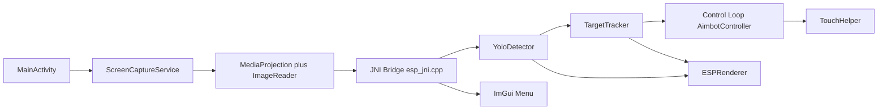

# Architecture

This document explains how AimBuddy works as an AI-based Android Aim Assistant, with focus on runtime data flow, module responsibilities, and safe change points.

## System Overview

- Android layer (Kotlin): permissions, lifecycle, foreground service orchestration, and UI.
- Native layer (C++): frame ingestion, detection, tracking, overlay rendering, and optional input assistance.
- Runtime modes:
  - Visual Assist Mode (no root): capture, inference, target tracking, and overlays.
  - Assisted Input Mode (root optional): visual assist features plus touch injection.

## High-Level Data Flow

## Android Layer Responsibilities

- `MainActivity.kt`: startup, permission sequence, native runtime control.
- `ScreenCaptureService.kt`: MediaProjection ownership and frame delivery.
- `ImGuiGLSurface.kt`: OpenGL surface that renders menu and overlays.
- `RootUtils.kt`: root availability checks and input device permission helpers.

## Native Layer Responsibilities

Path: `app/src/main/cpp`

- `esp_jni.cpp`: JNI entry point, runtime state transitions, inference thread lifecycle.
- `detector/`: model loading, NCNN inference, and post-processing.
- `aimbot/target_tracker.*`: target continuity and filtering logic.
- `aimbot/aimbot_controller.*`: motion control and target steering logic.
- `input/`: root-backed injection primitives.
- `renderer/`: overlay rendering and ImGui draw path.
- `utils/`: settings, timing, math, and shared support code.

Note: `aimbot/` is a legacy internal folder name. In documentation and UX, this project is described as an AI-based aim assistant.

## Startup and Permission Sequence

1. App launches and initializes native layer.
2. Overlay permission is validated.
3. MediaProjection permission is requested.
4. Foreground capture service starts.
5. Runtime capture, detection, and render loops begin.
6. Optional assisted input path is enabled only when root is available.

If any permission is denied, the app must remain responsive and provide actionable feedback.

## Runtime Contracts

- `UnifiedSettings` values are validated with `validate()` before hot-path usage.
- Render and control coordinate spaces stay aligned through centralized projection logic.
- Stop and restart paths are idempotent to prevent lifecycle race failures.
- Non-root mode always keeps visual pipeline functional.

## Safe Change Guide

- Permission or startup behavior: Android Kotlin layer.
- Detection behavior: `detector/`.
- Tracking and motion control behavior: `aimbot/`.
- Overlay and menu rendering: `renderer/`.
- Defaults, clamping, persistence: `settings.h` and `utils/aimbot_types.h`.
