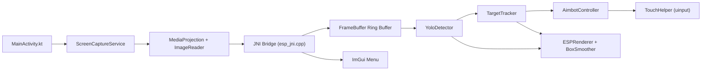
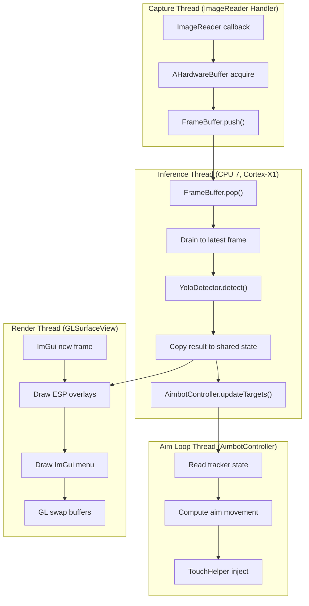
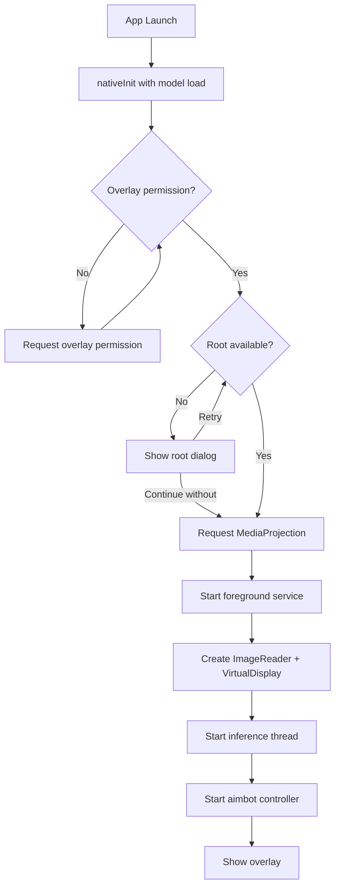
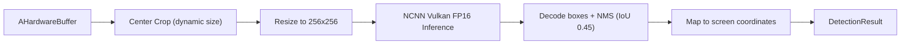
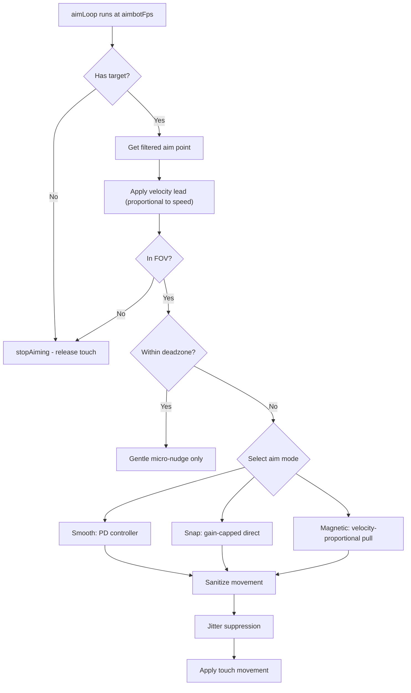

# Architecture

How AimBuddy works as an AI-based Android aim assistant, covering module responsibilities, data flow, threading, and safe change points.

## System Overview

AimBuddy runs as two cooperating layers:

- **Android layer (Kotlin)**: permissions, lifecycle, foreground service, screen capture, and overlay hosting.
- **Native layer (C++)**: frame ingestion, YOLO inference, target tracking, overlay rendering, and optional input assistance.

Two runtime modes:

| Mode | Root Required | Features |
|------|---------------|----------|
| Visual Assist | No | Capture, inference, tracking, ESP overlays |
| Assisted Input | Yes | Everything above plus touch injection |

## High-Level Data Flow

## Threading Model

AimBuddy uses four threads at runtime. Each runs on a specific CPU core for deterministic scheduling on Snapdragon SoCs.

### Thread Synchronization

| Shared Resource | Protection | Threads |
|----------------|------------|---------|
| FrameBuffer | Lock-free SPSC ring buffer (8 slots) | Capture to Inference |
| g_latestResult | std::mutex | Inference to Render |
| TargetTracker state | std::mutex (m_trackerMutex) | Inference to Aim Loop |
| g_settings (UnifiedSettings) | Relaxed copy-on-read | All threads |

## Frame Pipeline

The pipeline from screen capture to detection output:

1. **Capture**: `ImageReader` callback fires per frame at device refresh rate. Frame pushed as `AHardwareBuffer` into `FrameBuffer` (lock-free SPSC ring buffer, capacity 8).
2. **Drain**: Inference thread pops the ring buffer and drains to the latest frame, releasing stale buffers. This ensures inference always processes the most recent capture.
3. **Preprocess**: Center crop the capture buffer around screen center. Crop size is dynamic based on `fovRadius` and adaptive pressure.
4. **Inference**: NCNN Vulkan runs YOLOv26n (256x256 input, FP16) on the cropped region. Target cycle time: 8ms.
5. **Postprocess**: Decode boxes, apply NMS (IoU 0.45), and map coordinates from crop space back to screen space.
6. **Distribute**: Detection result is copied to shared state for the render thread and forwarded to the aimbot target tracker.

### Adaptive Crop

The inference loop dynamically adjusts the crop size to maintain the target cycle time:

- If inference or end-to-end latency exceeds the target, crop size shrinks by 16px (minimum 224px).
- If inference is under budget and no frames were drained, crop size grows by 8px up to the computed FOV-based size.
- This adapts automatically to different GPU speeds without manual tuning.

## Android Layer

| File | Responsibility |
|------|---------------|
| `MainActivity.kt` | Startup, permission sequence (overlay, root, MediaProjection), native lifecycle control |
| `ScreenCaptureService.kt` | Foreground service for MediaProjection, JNI bridge for frame delivery |
| `ImGuiGLSurface.kt` | OpenGL ES surface hosting ImGui render pass, touch event routing |
| `RootUtils.kt` | Root availability checks, `/dev/uinput` permission setup |

### Permission Sequence

## Native Layer

Path: `app/src/main/cpp`

| Directory/File | Responsibility |
|----------------|---------------|
| `esp_jni.cpp` | JNI entry point, thread lifecycle, inference loop, global state management |
| `settings.h` | Compile-time constants (capture size, model config, NCNN flags, thread affinity) |
| `detector/yolo_detector.*` | NCNN model loading, Vulkan inference, preprocess and postprocess |
| `detector/bounding_box.h` | BoundingBox struct with IoU, center, and coordinate helpers |
| `aimbot/target_tracker.*` | DeepSORT-style multi-target tracking with IoU + center distance matching |
| `aimbot/aimbot_controller.*` | Three aim modes (smooth, snap, magnetic), PD controller, velocity lead, touch injection |
| `input/touch_helper.*` | Linux uinput device creation, touch down/move/up injection |
| `renderer/esp_renderer.cpp` | ESP overlay rendering (boxes, snap lines, FOV circles) |
| `renderer/imgui_menu.cpp` | Full ImGui settings menu with presets, live editing, auto-save |
| `renderer/box_smoothing.h` | Temporal EMA smoothing for ESP box rendering (separate from aimbot filtering) |
| `utils/aimbot_types.h` | UnifiedSettings struct, TrackedTarget struct, math helpers, FixedArray |
| `utils/vector2.h` | 2D vector math |
| `utils/logger.h` | Android logcat macros with build-mode filtering |
| `utils/timer.h` | High-resolution timing |
| `utils/thread.h` | Thread wrapper with CPU affinity support |
| `utils/memory_pool.h` | Pre-allocated memory pool for zero-allocation hot paths |

## Detection Pipeline

Key configuration from `settings.h`:

| Parameter | Value | Purpose |
|-----------|-------|---------|
| CAPTURE_WIDTH/HEIGHT | 1280x720 | Capture resolution (SD for performance) |
| CROP_SIZE | 480 | Max center crop region |
| MODEL_INPUT_SIZE | 256 | NCNN input resolution |
| IMAGE_READER_MAX_IMAGES | 3 | Triple buffering |
| NMS_IOU_THRESHOLD | 0.45 | Non-maximum suppression |
| NUM_CLASSES | 1 | Single class (enemy) |

## Tracking Pipeline

TargetTracker uses a DeepSORT-inspired approach:

1. **Predict**: Existing tracks are moved forward using tracked velocity.
2. **Matching Cascade**: Tracks matched to detections by age (younger first), using combined IoU + center distance + area ratio scoring.
3. **Unmatched Tracks**: Lost counter incremented, velocity decayed. Tentative tracks dropped after 1 miss. Confirmed tracks dropped after `maxLostFrames` (default 8).
4. **New Tracks**: Unmatched detections create tentative tracks. Promoted to confirmed after 3 consecutive matches.

### Target Selection

`getBestTargetCopy()` selects the best track with hysteresis:

- Only CONFIRMED enemy tracks within `aimFovRadius` are candidates.
- Priority modes: nearest to crosshair, largest box, or highest confidence.
- Locked target gets a switch threshold (default 1.3x better required to switch).
- Switch cooldown prevents rapid target flickering.

## Aim Control Pipeline

### Aim Modes

| Mode | Behavior | Best For |
|------|----------|----------|
| Smooth (0) | PD controller with convergence damping, derivative brake | General use, natural feel |
| Snap (1) | Gain-capped proportional, fast acquisition | Fast response, competitive |
| Magnetic (2) | Distance-proportional pull, gentle near lock | Precision, minimal overshoot |

### Input Injection

TouchHelper creates a Linux uinput virtual touch device:

1. Opens `/dev/uinput` (requires root for permissions).
2. Creates a virtual multitouch device with screen resolution axes.
3. Injects `ABS_MT_SLOT`, `ABS_MT_TRACKING_ID`, `ABS_MT_POSITION_X/Y` events.
4. Touch is constrained to a configurable radius around a center point.

## Settings System

All runtime settings live in `UnifiedSettings` (defined in `utils/aimbot_types.h`):

- Binary serialized to `/data/local/tmp/settings.bin`.
- Magic number `0xE5BA1005` for format validation.
- `validate()` clamps all values to safe ranges before hot-path use.
- Settings are read by copy (snapshot) in each thread to avoid contention.
- Auto-saved after a short delay following menu edits.

## Runtime Contracts

- `UnifiedSettings` values are validated with `validate()` before every hot-path usage.
- Render and control coordinate spaces stay aligned through centralized projection logic.
- Stop and restart paths are idempotent to prevent lifecycle race failures.
- Non-root mode always keeps the visual pipeline functional.
- Zero-detection fast-release: touch is released immediately when no enemies are detected.

## Safe Change Guide

| What to Change | Where to Look |
|----------------|---------------|
| Permission or startup behavior | `MainActivity.kt`, `RootUtils.kt` |
| Capture resolution or buffering | `settings.h`, `MainActivity.kt` |
| Detection model or preprocessing | `detector/` |
| Tracking association or lock logic | `aimbot/target_tracker.*` |
| Aim modes or motion control | `aimbot/aimbot_controller.*` |
| Touch injection mechanism | `input/touch_helper.*` |
| ESP overlay rendering | `renderer/esp_renderer.cpp`, `renderer/box_smoothing.h` |
| Menu layout and presets | `renderer/imgui_menu.cpp` |
| Defaults, clamping, persistence | `settings.h`, `utils/aimbot_types.h` |

## Related Documentation

- [Settings Guide](SettingsGuide.md)
- [Performance](Performance.md)
- [Training](Training.md)
- [Troubleshooting](Troubleshooting.md)
