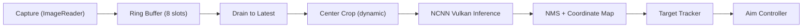

# Performance Guide

How to measure, evaluate, and improve AimBuddy runtime performance.

## Pipeline Architecture



## Performance Targets

| Metric | Target | Notes |
|--------|--------|-------|
| Inference cycle | < 8 ms | kTargetCycleMs in inference loop |
| End-to-end latency | < 20 ms | Capture timestamp to detection output |
| Aim loop rate | 60 Hz | Configurable via aimbotFps (30 to 120) |
| Overlay frame rate | 60 FPS | GLSurfaceView render rate |
| Frame drops (push) | 0 | Ring buffer should absorb capture bursts |
| Memory usage | < 100 MB | Includes NCNN model and buffers |

## Critical Runtime Paths

These paths run every frame and must avoid allocations, locks, and unnecessary work:

1. **Inference loop** (`esp_jni.cpp: inferenceLoop`): Frame pop, drain, YOLO detect, result copy, aimbot update.
2. **Target tracker** (`target_tracker.cpp: update`): Detection-to-track association, velocity estimation, track lifecycle.
3. **Aim control** (`aimbot_controller.cpp: aimLoop`): Target selection, filter reads, movement calculation, touch injection.
4. **Overlay render** (`imgui_menu.cpp: nativeTick`): Detection snapshot, box smoothing, ImGui draw submission.

## Key Optimizations

### Triple Buffering

ImageReader uses 3 buffers (triple buffering) to prevent capture stalls:
- With 2 buffers, the producer blocks when both are in use (one being captured, one being consumed by inference), limiting throughput to ~30 FPS.
- With 3 buffers, the capture can always write while inference consumes, achieving 60+ FPS.

### Adaptive Crop Sizing

The inference loop dynamically adjusts the center crop size:

| Condition | Action |
|-----------|--------|
| EMA inference > 8ms or end-to-end > 20ms | Shrink crop by 16px (min 224) |
| Backlog frames drained > 0 | Shrink crop by 16px |
| Both pressure signals clear | Grow crop by 8px (up to FOV-based target) |

This automatically adapts to different GPU speeds. Faster GPUs get larger crop areas for better detection coverage.

### Zero-Allocation Hot Paths

- `DetectionResult` uses `FixedArray` (stack-allocated, max 50 detections).
- `TargetArray` uses `FixedArray` (stack-allocated, max 50 tracks).
- `FrameBuffer` is a lock-free SPSC ring buffer with no heap allocation (`Config::RING_BUFFER_CAPACITY = 8`).
- NCNN input mat is pre-allocated and reused.

### NCNN Vulkan Configuration

Optimized for Adreno 660 (Snapdragon 888):

| Setting | Value | Impact |
|---------|-------|--------|
| FP16 packed | Enabled | 2x throughput on Adreno FP16 ALUs |
| FP16 storage | Enabled | Halved memory bandwidth |
| FP16 arithmetic | Enabled | Native FP16 compute |
| Packing layout | Enabled | Better GPU register utilization |
| Light mode | Enabled | Reduced memory footprint |
| Vulkan compute | Enabled | Uses GPU compute shaders (`NCNN_USE_VULKAN_COMPUTE`) |
| CPU threads fallback | 4 | Fallback path (`NCNN_NUM_THREADS`) |

### Thread Affinity

| Thread | Core | CPU |
|--------|------|-----|
| Inference | 7 | Cortex-X1 (big core) |
| Render | GLSurfaceView managed | Constant exists (`RENDERING_THREAD_CPU_AFFINITY = 6`), not forced by current startup path |
| Aim loop | OS-scheduled | Any available |
| Capture | OS-scheduled (Handler thread) | Any available |

## Measuring Performance

### Built-in Telemetry

The inference loop logs pipeline stats every 120 frames:

```
Pipeline stats: avg infer=X.XXms avg e2e=X.XXms ema infer=X.XXms ema e2e=X.XXms crop=XXX drained=X dropped_push=X
```

Filter in logcat:

```
adb logcat -s AimBuddy_Native:I
```

### Key Counters

| Counter | Meaning | Healthy Value |
|---------|---------|---------------|
| avg infer | Mean inference time per frame | < 10ms |
| avg e2e | Mean capture-to-result latency | < 20ms |
| crop | Current adaptive crop size | 224 to 480 |
| drained | Frames skipped to catch up | < 2 per window |
| dropped_push | Frames dropped because ring buffer was full | 0 |

### ImGui Info Tab

The in-app Info tab shows:
- Overlay FPS (render rate)
- Inference time (ms)
- Detection count
- Screen resolution

## Performance Change Policy

1. Every optimization requires before and after measurements.
2. Reject speed improvements that reduce tracking quality or stability.
3. Avoid visual complexity additions unless measured benefit is clear.
4. Keep logs out of hot loops in release builds (NDEBUG suppresses all but errors).
5. Test on at least one mid-range and one high-end arm64 device.

## Build Check

```powershell
./gradlew.bat clean assembleDebug
```

Run with on-device logcat profiling to validate runtime impact.

## Related Documentation

- [Architecture](Architecture.md)
- [Settings Guide](SettingsGuide.md)
- [Training](Training.md)
- [Troubleshooting](Troubleshooting.md)
