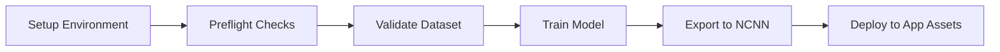
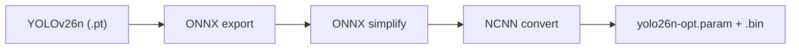

# Training Guide

How to train a YOLOv26n model and export it for AimBuddy runtime using the bundled training pipeline.

## Model Contract

AimBuddy expects a single-class YOLOv26n model (class 0 = enemy). The NCNN runtime loads two files from `app/src/main/assets/models/`:

| File | Purpose |
|------|---------|
| `yolo26n-opt.param` | NCNN model graph definition |
| `yolo26n-opt.bin` | NCNN model weights |

## Environment Requirements

| Item | Minimum | Recommended |
|------|---------|-------------|
| OS | Windows 10 or 11 (64-bit) | Windows 11 |
| Python | 3.10 to 3.12 | 3.11 |
| CPU | 4 cores | 8+ cores |
| RAM | 8 GB | 16 GB+ |
| Free disk | 15 GB | 30 GB+ |
| GPU | CPU-only supported | NVIDIA GPU with CUDA 12.1 |

## Pipeline Overview



### One-Command Run

```powershell
cd training
scripts\07_run_full_pipeline.bat
```

This runs all steps in sequence: environment setup, preflight checks, dataset validation, training, and NCNN export.

### Full Pipeline Flags

`scripts\07_run_full_pipeline.bat` forwards flags to `src/run_pipeline.py`:

| Flag | Purpose |
|------|---------|
| `--manual` | Force manual training config from `config.ini` |
| `--adaptive` | Force adaptive hyperparameter selection |
| `--skip-export` | Stop after training (skip NCNN export) |
| `--non-strict-preflight` | Warn on minimum hardware failures instead of stopping |
| `--config <path>` | Use a custom config file |

Example:

```powershell
scripts\07_run_full_pipeline.bat --manual --skip-export
```

## Step-by-Step Scripts

Run from the `training/` directory:

| Script | Purpose |
|--------|---------|
| `scripts\01_setup_environment.bat` | Create virtual environment, install dependencies |
| `scripts\02_extract_frames.bat` | Extract video frames for labeling (optional) |
| `scripts\03_validate_dataset.bat` | Verify dataset structure and label format |
| `scripts\04_train_adaptive.bat` | Train with auto-selected hyperparameters |
| `scripts\05_train_manual.bat` | Train with explicit config from `training/config/config.ini` |
| `scripts\06_export_ncnn.bat` | Convert trained weights to NCNN format |
| `scripts\07_run_full_pipeline.bat` | Run all steps end-to-end |

### Preflight Strictness Modes

- `scripts\01_setup_environment.bat` runs preflight with `--non-strict`.
- `scripts\04_train_adaptive.bat` and `scripts\05_train_manual.bat` run strict preflight.
- `scripts\07_run_full_pipeline.bat` runs strict preflight by default, and supports `--non-strict-preflight`.

If strict mode blocks your hardware, run the full pipeline with `--non-strict-preflight` and review the generated report warnings.

### Frame Extraction Details

`scripts\02_extract_frames.bat` uses runtime-aligned preprocessing:

- Resizes input video to 720p height.
- Applies center crop (`--crop`, default `480`).
- Resizes to `imgsz` from config (default `256`).
- Extracts at `--fps` frames per second (default `1.0`).

Output path:

```text
training/raw_frames/<video_name>/
```

## Dataset Structure

Required layout:

```
training/dataset/
    data.yaml
    train/
        images/
        labels/
    valid/
        images/
        labels/
    test/
        images/
        labels/
```

### Label Format

YOLO format, one `.txt` file per image:

```
class_id x_center y_center width height
```

Rules:
- All coordinates normalized to [0, 1].
- Class ID must be `0` (single class: enemy).
- No data leakage between train, valid, and test splits.
- Include background-only images (empty label files) to reduce false positives.

### data.yaml Example

```yaml
train: train/images
val: valid/images
test: test/images
nc: 1
names: ['enemy']
```

## Training Modes

### Adaptive Training

Auto-selects hyperparameters based on dataset size:

```powershell
scripts\04_train_adaptive.bat
```

Good for first-time training or when unsure about settings.

Adaptive thresholds:

| Dataset size (train images) | Typical resolved behavior |
|-----------------------------|---------------------------|
| `< 300` | epochs around 260, batch constrained to 8-12, higher patience |
| `300 to < 1200` | epochs around 180, batch constrained to 12-20 |
| `>= 1200` | epochs around 120, batch constrained to 16-32, lower patience |

### Manual Training

Uses explicit values from `training/config/config.ini`:

```powershell
scripts\05_train_manual.bat
```

Use this when you need specific epoch counts, batch sizes, or augmentation settings.

### Resolved Configuration

The final configuration used for training is saved to:

```
training/outputs/reports/selected_training_config.json
```

## NCNN Export

```powershell
scripts\06_export_ncnn.bat
```

Export flow:



The exported NCNN files must be copied to:

```
app/src/main/assets/models/
```

File names must match the constants in `settings.h`:
- `MODEL_PARAM_FILE = "models/yolo26n-opt.param"`
- `MODEL_BIN_FILE = "models/yolo26n-opt.bin"`

Path format note:
- Configuration paths intentionally use forward slashes (`/`) for cross-platform behavior, including on Windows.

## Output Locations

| Output | Path |
|--------|------|
| Training reports | `training/outputs/reports/` |
| Trained weights | `training/outputs/runs/detect/train/weights/` |
| NCNN export working copy | `training/outputs/export/` |
| Deployment target used by app runtime | `app/src/main/assets/models/` |

The export step writes to `training/outputs/export/` and copies the same files into app assets.

## Preflight Checks

The preflight script validates:

- Python version (3.10 to 3.12)
- CPU core count and available memory
- Disk space
- CUDA availability (warning if not found, training proceeds on CPU)

Results saved to: `training/outputs/reports/preflight_report.json`

GPU status values in `preflight_report.json`:

| gpu_status | Meaning |
|------------|---------|
| `cuda_ready` | CUDA torch stack available and usable |
| `torch_cuda_unavailable` | NVIDIA GPU exists but torch CUDA is unavailable |
| `torch_missing_or_incompatible` | torch import/runtime issue in current environment |
| `no_gpu` | No NVIDIA GPU detected |

## Report Files

| File | Contents |
|------|----------|
| `preflight_report.json` | Environment validation results |
| `dataset_report.json` | Dataset statistics and validation |
| `selected_training_config.json` | Resolved training hyperparameters |
| `pipeline_last_run.json` | Pipeline step status and timings |
| `pipeline_last_run.log` | Full pipeline stdout/stderr |

### Model Contract Validation

Before exporting custom checkpoints, verify single-class runtime compatibility:

```powershell
cd training
python src\check_model_contract.py --weights outputs\runs\detect\train\weights\best.pt
```

## Common Issues

| Problem | Solution |
|---------|----------|
| CUDA not detected by torch | Install CUDA 12.1, reinstall torch with CUDA wheel |
| Dataset validation fails | Fix label format, check normalized coordinates |
| Export succeeds but app does not detect | Copy NCNN files to `app/src/main/assets/models/`, rebuild |
| Base model download fails during setup | Manually place `yolo26n.pt` in `training/` root, rerun setup |
| Training is very slow | Use NVIDIA GPU, or reduce dataset size for faster iterations |
| Out of memory during training | Reduce batch size in `config.ini`, or use adaptive mode |

For script-level folder details, see [training/README.md](../training/README.md).

## Related Documentation

- [Architecture](Architecture.md)
- [Settings Guide](SettingsGuide.md)
- [Performance](Performance.md)
- [Troubleshooting](Troubleshooting.md)
