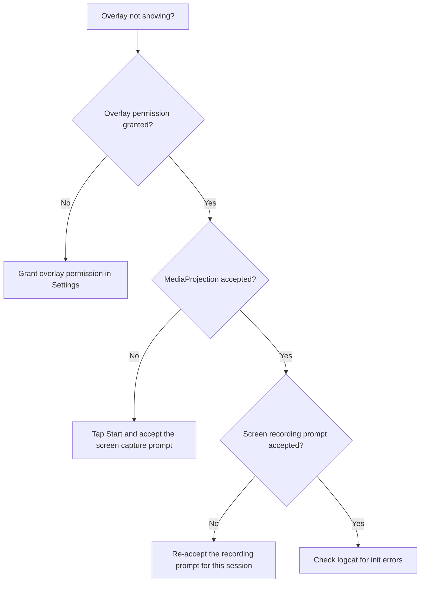

# Troubleshooting

Common setup, build, runtime, and training issues for AimBuddy with step-by-step resolution.

## Build Issues

### NDK or CMake Mismatch

Symptoms:
- Gradle native build fails with CMake errors
- Linking errors or missing symbols

Fix:
1. Install Android NDK `29.0.13113456 rc1` through SDK Manager.
2. Install CMake `3.22.1` through SDK Manager.
3. Clean and rebuild:

```powershell
./gradlew.bat clean assembleDebug
```

### NCNN Library Not Found

Symptoms:
- Native linker errors referencing NCNN symbols

Fix:
1. Verify NCNN prebuilt libraries exist under `app/src/main/cpp/ncnn/`.
2. Check that `CMakeLists.txt` references the correct NCNN path for your ABI (`arm64-v8a`).
3. Rebuild after syncing.

### __libcpp_verbose_abort Linker Error

Symptoms:
- Undefined symbol `__libcpp_verbose_abort` during native link

This is caused by an NCNN library built against a different NDK libc++ version. The fix is already in `esp_jni.cpp` which defines the missing symbol. If you see this after updating NCNN, verify the compatibility shim is still present.

## Installation Issues

### App Installs But Overlay Does Not Appear



### App Crashes on Launch

Possible causes:
1. Model files missing from `app/src/main/assets/models/`. Need `yolo26n-opt.param` and `yolo26n-opt.bin`.
2. Vulkan not supported on the device. Check `adb logcat -s AimBuddy_Native:E` for GPU initialization errors.
3. Incorrect ABI. AimBuddy only supports `arm64-v8a`.

## Runtime Issues

### No Detections Showing

1. Verify model files are present in `app/src/main/assets/models/`.
2. Check `confidenceThreshold` is not set too high (try lowering to 0.3).
3. Verify the game is in landscape orientation (capture is 1280x720 landscape).
4. Check logcat for inference errors:

```powershell
adb logcat -s AimBuddy_Native:E
```

### Low Inference FPS (Below 60)

1. Check pipeline stats in logcat:

```powershell
adb logcat -s AimBuddy_Native:I | findstr "Pipeline stats"
```

2. If `avg infer` is high (> 15ms), the GPU may be slow. The adaptive crop will automatically shrink to compensate.
3. If `dropped_push` is high, the ring buffer is filling up. This should not happen with triple buffering (3 ImageReader buffers).
4. Ensure no other GPU-heavy apps are running.

### Aim Assist Not Working (Visual Assist Mode Only)

Root is required for assisted input. Without root:
- ESP overlays work normally.
- The "Enable Aim Assist" toggle is grayed out.
- The app shows "Root not granted (ESP mode)" in the menu.

To enable aim assist:
1. Install a root manager (Magisk or KernelSU).
2. Grant root when prompted on app start.
3. If root was denied, tap Start again to retry.

### Touch Injection Fails After Root Grant

1. Verify `/dev/uinput` exists and is accessible:

```powershell
adb shell su -c "ls -la /dev/uinput"
```

2. The app sets permissions automatically (`chmod 666 /dev/uinput`), but some ROMs may block this.
3. SELinux enforcement is temporarily disabled (`setenforce 0`). If your ROM re-enables it, touch injection will fail.
4. Check logcat:

```powershell
adb logcat -s TouchHelper:E
```

### Aim Is Shaky on Still Targets

Cause: Detector jitter passing through the aim filter.

Fixes:
1. Select the EMA or Kalman stabilization filter (Aim tab > Stabilization filter).
2. Lower `EMA alpha` (try 0.20 to 0.30). Lower values smooth more.
3. Use a preset like "Balanced" or "Precision" which have stronger smoothing.

### Aim Does Not Track Moving Targets

Cause: Velocity lead is too low or disabled.

Fixes:
1. Increase `Velocity lead` slider (try 0.20 to 0.30).
2. Increase `Lead clamp` slider (try 16 to 20 px).
3. Use the "Competitive" preset which has the highest lead values.

### Touch Stays On When No Enemies Visible

Cause: Ghost tracks lingering in the tracker.

Fixes:
1. Reduce `Miss grace` slider (try 1 to 2).
2. This controls how many frames the locked target survives without a detection match.
3. The zero-detection fast-release should handle this automatically. If it does not, check logcat for tracker anomalies.

### Aim Oscillates Near Target

Cause: Overshoot from aggressive settings.

Fixes:
1. Enable "Anti overshoot" checkbox.
2. Increase "Damp radius" (try 30 to 50 px).
3. Reduce "Aim speed" (try 0.40 to 0.55).
4. Increase "Derivative damping" (try 0.04 to 0.06).
5. Use the "Balanced" or "Precision" preset.

### Settings Not Persisting After Restart

1. Settings are saved to `/data/local/tmp/settings.bin`.
2. Verify the app has write access:

```powershell
adb shell ls -la /data/local/tmp/settings.bin
```

3. If the file does not exist, tap "Save now" in the menu.
4. If settings load but values seem wrong, tap a preset button to reset to known-good values.

## Training Pipeline Issues

### Environment Setup Fails

1. Use Python 3.10 to 3.12 (3.11 recommended).
2. Re-run setup:

```powershell
cd training
scripts\01_setup_environment.bat
```

3. Review the preflight report: `training/outputs/reports/preflight_report.json`.

If strict preflight fails on scripts `04` or `05`, run the full pipeline with non-strict preflight:

```powershell
cd training
scripts\07_run_full_pipeline.bat --non-strict-preflight
```

### CUDA Not Available in Torch

Symptoms:
- NVIDIA GPU detected but training runs CPU-only

Fix:
1. Confirm Python version is 3.10 to 3.12.
2. Install CUDA 12.1 and the matching torch wheel.
3. Verify with: `python -c "import torch; print(torch.cuda.is_available())"`

### Dataset Validation Fails

Review: `training/outputs/reports/dataset_report.json`

Common fixes:
1. Fix malformed YOLO label rows (format: `class_id x_center y_center width height`).
2. Ensure all coordinates are normalized to [0, 1].
3. Remove duplicate images across train/valid/test splits.
4. Include background-only images to reduce false positives.

### Export Succeeds But App Cannot Detect

1. Verify exported files are copied to `app/src/main/assets/models/`.
2. File names must match `settings.h`: `yolo26n-opt.param` and `yolo26n-opt.bin`.
3. Rebuild and reinstall the app.

### Model Contract Check Fails

Symptoms:
- `check_model_contract.py` reports class-count or shape mismatch.

Fix:
1. Verify `training/dataset/data.yaml` uses exactly one class (`nc: 1`, class id `0`).
2. Retrain and re-run contract check:

```powershell
cd training
python src\check_model_contract.py --weights outputs\runs\detect\train\weights\best.pt
```

## Useful Commands

```powershell
# Build
./gradlew.bat clean assembleDebug

# Install
./gradlew.bat installDebug

# View runtime logs
adb logcat -s AimBuddy_Native:I

# View errors only
adb logcat -s AimBuddy_Native:E

# Check touch device
adb shell su -c "ls -la /dev/uinput"

# Full training pipeline
cd training
scripts\07_run_full_pipeline.bat
```

## Related Documentation

- [README](../README.md)
- [Architecture](Architecture.md)
- [Settings Guide](SettingsGuide.md)
- [Training](Training.md)
- [Performance](Performance.md)
